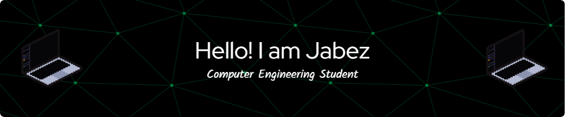

  

###

  
  
  

###

  

 
<h1 align="center"> Welcome to my Github profile👋</h1>

###

 I'm a Computer Engineering student at MSU-IIT with a passion for building intelligent and user-centric systems. I bridge the gap between Software Engineering, AI, and Design, focusing on Full-Stack development and creating intuitive user experiences.

###

<h3 align="left">👩‍💻  About Me</h3>

###

📗 <b>Education:</b> Bachelor of Science in Computer Engineering (MSU-IIT). 
🎨 <b>UI/UX Exploration:</b> Currently deep-diving into UI/UX principles to design interfaces that are both functional and aesthetically pleasing. 
💻 <b>Development:</b> Building interactive mobile and web applications using Next.js, React, and Flutter. 
🧠 <b>Interests:</b> Researching Deep Learning architectures and their application in modern Computer Vision problems. 
🚀 <b>Currently Learning: </b> Advanced Web Architecture and Cross-Platform Mobile ecosystems to build scalable, production-ready applications.

###

<h3 align="center">🛠  Languages and Tools</h3>

###

<h4 align="left">🤖 Artificial Intelligence & Data Science</h4>

  
  
  
  
  
   
  
  
  
  

 

<h4 align="left">🌐 Web & Mobile Development</h4>

  
  
  
  
  
   
  
  
  
  
   
  
  
  

 

<h4 align="left">💻 General Software & Embedded</h4>

  
  
  

 

<h4 align="left">🎨 UI/UX & Design</h4>

  
  
  

 

<h4 align="left">⚙️ Tools & Environment</h4>

  
  
  
  
  
  
  
  
  
  
  
  
  

###

<h6 align="center">Currently exploring the intersection of Design, Deep Learning, and modern Software Engineering. Just building, and learning as I go.</h6>

###

  

