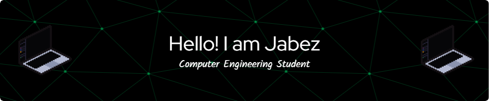

  

###

  
  

###

<h2 align="center">Hey, I'm Jabez 👋</h2>

  Computer Engineering at MSU-IIT. 

###

I've worked across embedded systems, touched deep learning through my thesis, and I'm currently finding my footing in software and design. Still figuring it out — but getting sharper at it.

###

<h3 align="left">🧰 My Go-To's</h3>

**🎨 UI/UX Design**

  
  
  

 

**🧠 Deep Learning**

  
  
  
  
  
  
  
  
  

 

**🌐 Web Development**

  
  
  
  
  <!--  -->
  <!-- 
  
   -->

 

**⚙️ Embedded Systems**

  
  
  
  
  
  
  
  

###

<h6 align="center">Just building, and learning as I go.</h6>
